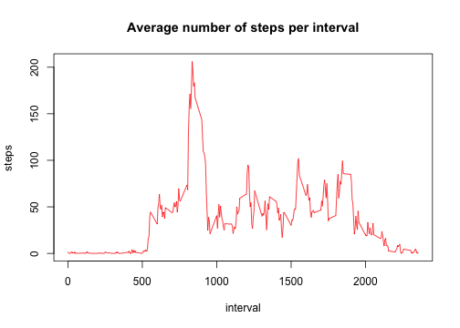

# Reproducible Research: Peer Assessment 1


## Loading and preprocessing the data


```r
# read data into table, directly from ZIP file
activity <- read.table(unz("activity.zip", "activity.csv"), header = T, sep = ",", 
    colClasses = c("integer", "Date", "integer"))
```


## What is mean total number of steps taken per day?


```r
# sum number of steps over each day. Do not remove NAs as this could lead
# to days with less steps than reality
stepsperday <- tapply(activity$steps, activity$date, sum)
hist(stepsperday, xlab = "Number of steps per day", main = "", col = "red")
```

 


* Average steps per day: 1.0766 &times; 10<sup>4</sup>

* Median steps per day: 10765


## What is the average daily activity pattern?


```r
# Average steps per interval, over days. This time, remove NAs
stepsperinterval <- tapply(activity$steps, activity$interval, mean, na.rm = TRUE)
plot(as.integer(names(stepsperinterval)), stepsperinterval, xlab = "interval", 
    ylab = "steps", main = "Average number of steps per interval", col = "red", 
    type = "l")
```

 


* Interval with max number of steps: 835

## Imputing missing values

* Total number of missing values: 2304

We replace the missing values with the average number of steps for the interval over the remaining number of days.


```r
activity2 <- activity
# detect missing values
k <- which(is.na(activity$steps), arr.ind = TRUE)
activity2[k, "steps"] <- stepsperinterval[as.character(activity[k, "interval"])]
stepsperday2 <- tapply(activity2$steps, activity2$date, sum)
hist(stepsperday2, xlab = "Number of steps per day", main = "", col = "red")
```

 


* Average steps per day: 1.0766 &times; 10<sup>4</sup>

* Median steps per day: 1.0766 &times; 10<sup>4</sup>

The average number of steps per day has not changed, but the median has. Imputing values can arbitrarily change our estimates. In our case, since we replace the missing values with averages, we "smooth" the distribution of the values and reduce the variance.

### Explanation

This is not within the scope of the homework.

Let us look where our missing values are:


```r
nadates = unique(activity[is.na(activity$steps), "date"])
nadates
```

```
## [1] "2012-10-01" "2012-10-08" "2012-11-01" "2012-11-04" "2012-11-09"
## [6] "2012-11-10" "2012-11-14" "2012-11-30"
```


In the dates where there are NAs, there are 0 non-NA values.

The average number of steps per day is given by 
$$\frac{\sum_{number\, of\, days} \sum_{intervals} steps}{number \, of \, days}$$

In the case where we do not replace the NAs, the value is

$$\frac{\sum_{number\, of\, days - nadates} \sum_{intervals} steps}{number \, of \, days - nadates}$$

In the case we replace the values with the average steps duting that interval over the other days, we have 

$$steps(interval) = \frac{\sum_{number\, of\, days - nadates} steps(day,interval)}{number\, of\, days - nadates}$$ thus the average steps per day for the replaced values is

$$\frac{\sum_{nadates} \sum_{intervals}  \frac{\sum_{number\, of\, days - nadates} steps(day,interval)}{number\, of\, days - nadates} }{nadates}
=
\sum_{intervals}  \frac{\sum_{number\, of\, days - nadates} steps(day,interval)}{number\, of\, days - nadates} = \frac{\sum_{number\, of\, days - nadates} \sum_{intervals} steps}{number\, of\, days - nadates}.
$$

The average total number of steps per day is the same for the days with previously NAs and the actual data. This is why the mean does not change.

## Are there differences in activity patterns between weekdays and weekends?


```r
library(lattice)
# weekend: T(1), weekday: F (0) and use to create factor
day = factor(as.integer(weekdays(activity2$date) == "Sunday" | weekdays(activity2$date) == 
    "Saturday"), labels = c("Weekday", "Weekend"))
# add new column to data frame
activity2$day <- day
# aggregate by interval and weekend/weekday
stepsperinterval <- aggregate(activity2$steps, by = list(activity2$interval, 
    activity2$day), FUN = mean)
# colnames get messed up, correct
colnames(stepsperinterval) <- c("interval", "day", "steps")
xyplot(steps ~ interval | day, data = stepsperinterval, layout = c(1, 2), type = "l", 
    col = "red", par.settings = list(strip.background = list(col = "lightgrey")))
```

 

